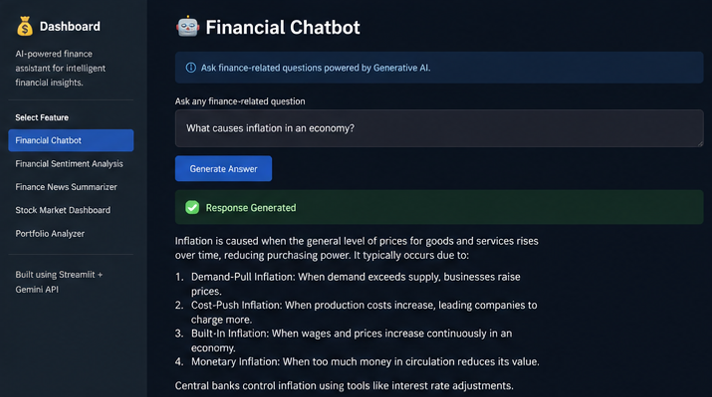
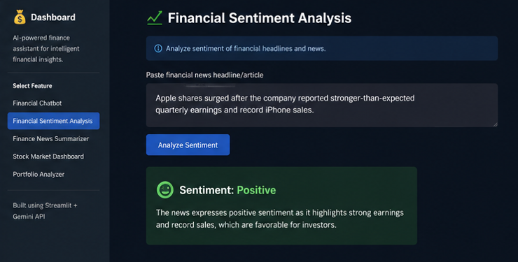
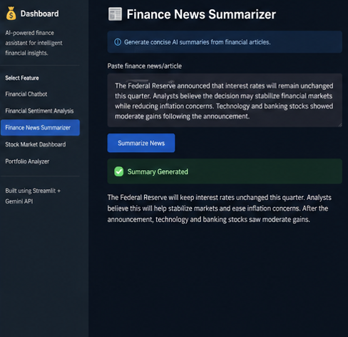
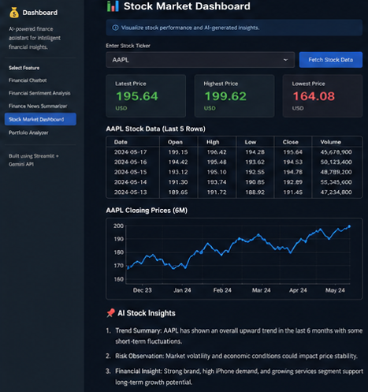
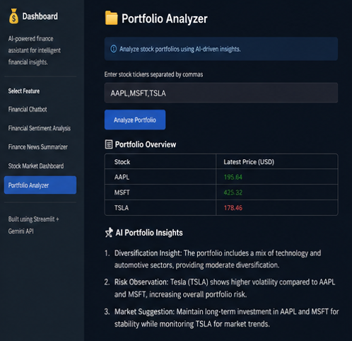

# 💰 AI Financial Assistant

AI-powered financial assistant built using Streamlit, Gemini API, and financial analytics tools.
This application leverages Generative AI and NLP workflows to provide intelligent financial insights, sentiment analysis, stock visualization, and portfolio analytics.

---

## 🚀 Features

### 🤖 Financial Chatbot

* Ask finance-related questions using Generative AI
* Get concise and professional financial explanations
* AI-powered responses using Gemini API

### 📈 Financial Sentiment Analysis

* Analyze sentiment of financial news headlines/articles
* Detect Positive, Neutral, or Negative sentiment
* Useful for financial market interpretation

### 📰 Finance News Summarizer

* Generate concise summaries of financial articles
* Extract important financial insights automatically
* NLP-powered summarization workflow

### 📊 Stock Market Dashboard

* Real-time stock visualization using Yahoo Finance
* Interactive stock performance graphs
* AI-generated stock insights and trend analysis

### 📂 Portfolio Analyzer

* Analyze portfolios using stock tickers
* AI-driven diversification and risk insights
* Portfolio overview with financial recommendations

---

## 🛠️ Tech Stack

* Python
* Streamlit
* Gemini API
* yfinance
* pandas
* matplotlib

---

## 📸 Screenshots

### Financial Chatbot



### Financial Sentiment Analysis



### Finance News Summarizer



### Stock Market Dashboard



### Portfolio Analyzer



---

## ⚙️ Installation

### Clone Repository

```bash
git clone https://github.com/YOUR_USERNAME/AI-Financial-Assistant.git
cd AI-Financial-Assistant
```

### Create Virtual Environment

#### Windows

```bash
python -m venv venv
venv\Scripts\activate
```

#### Mac/Linux

```bash
python3 -m venv venv
source venv/bin/activate
```

### Install Dependencies

```bash
pip install -r requirements.txt
```

---

## 🔑 Gemini API Setup

Create:

```text
.streamlit/secrets.toml
```

Add:

```toml
GEMINI_API_KEY="YOUR_GEMINI_API_KEY"
```

Get API key from:

https://aistudio.google.com/app/apikey

---

## ▶️ Run Application

```bash
streamlit run app.py
```

Open browser:

```text
http://localhost:8501
```

---

## 📂 Project Structure

```text
AI-Financial-Assistant/
│
├── .streamlit/
│   └── secrets.toml
│
├── screenshots/
│   ├── chatbot.png
│   ├── sentiment.png
│   ├── summarizer.png
│   ├── stock_dashboard.png
│   └── portfolio.png
│
├── app.py
├── requirements.txt
└── README.md
```

---

## 🎯 Future Improvements

* PDF Financial Report Summarization
* Authentication System
* Live Financial News Integration
* RAG-based Financial Assistant
* Voice-enabled Financial Assistant
* Advanced Portfolio Analytics

---

## 📌 Resume Project Description

AI Financial Assistant using Generative AI

* Developed an AI-powered financial assistant using Gemini API, NLP workflows, and financial datasets for intelligent financial query answering and sentiment analysis.
* Built interactive AI-driven tools including financial news summarization, portfolio analysis, and real-time stock market visualization.
* Integrated Generative AI workflows with scalable Python-based applications to support finance-focused automation and intelligent insights.

---

## 👨‍💻 Author

Sanjeev Manvith Vellala

Live Demo : "https://ai-financial-project-mdrgd4p3dkqudsnsyggrxw.streamlit.app/"
